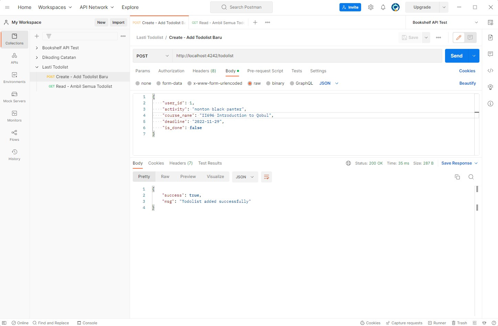
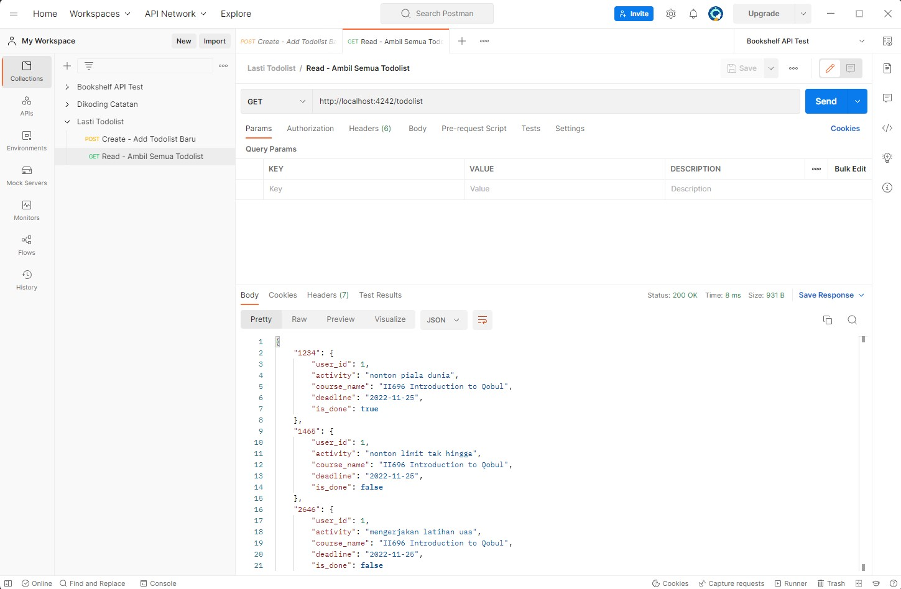

# lasti-tubes

1. Pull semuanya
2. Buka terminal di direktori lasti-nubes
3. masukkin
```
npm install
```

4. Terus untuk jalanin aplikasinya
```
npm start
```

5. Buka browser anda dan buka http://localhost:4242/todolist

# Testing Menggunakan Postman

### Create - Tambah todolist


### Read - Ambil semua todolist

