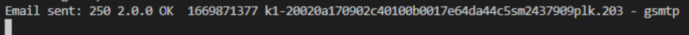
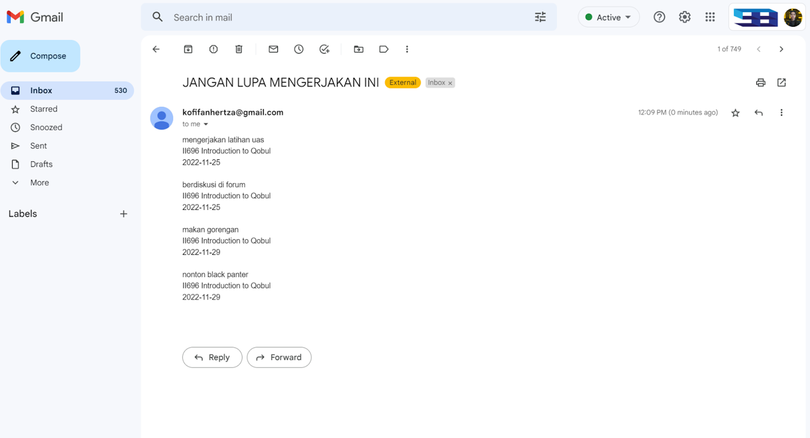
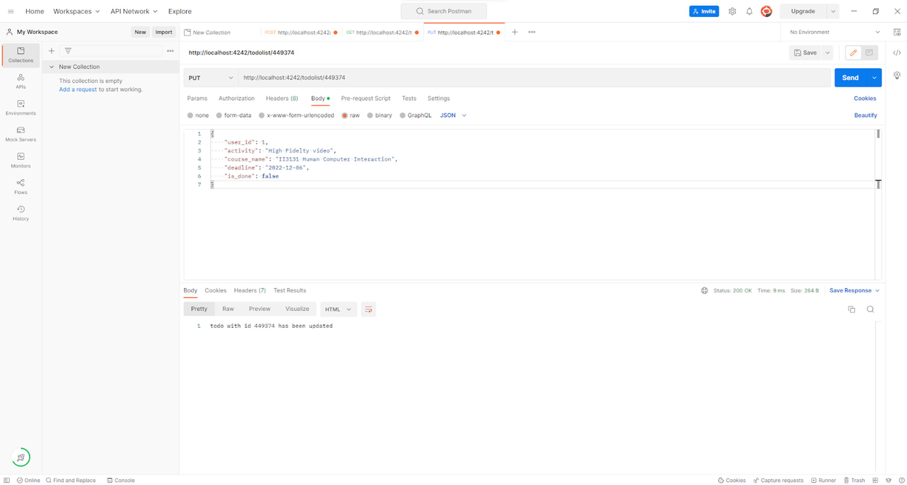
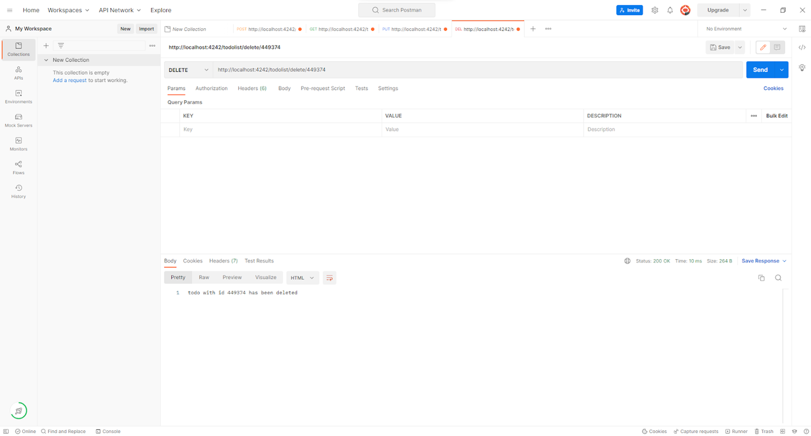

# TUGAS BESAR IF3120 - Layanan STI : Smart Classroom

## Kelompok 5 K2
+ Kofifan Hertza H 18220022
+ Akmal Jauhar Sidqi 18220038
+ Faris Tristan Fabian 18220042
+ Ammar Raihan 18220044
+ Muhammad Ammar M 18220072
+ Sitanggang Jerry Josia P 18220082


## Penjelasan Layanan
Layanan yang diusulkan berada pada proses bisnis asynchronous class, yaitu menambahkan fitur todo list serta service task reminder yang didasarkan dari data todo list. Todo list akan digenerate otomatis dari task yang diberikan oleh lecturer. Tugas pembelajaran bisa dalam bentuk menonton video, melakukan diskusi di forum, dan membaca material class. Selanjutnya layanan task reminder akan mengecek status seluruh to do list tersebut secara berkala. Ketika tugas pembelajaran yang diberikan belum dilakukan dan deadline sudah cukup dekat, maka layanan akan mengirimkan email kepada student tersebut sebagai reminder untuk segera melakukan tugas-tugas pembelajaran tersebut.


## Cara menjalankan aplikasi
1. Pull semuanya
2. Buka terminal di direktori lasti-nubes
3. masukkin
```
npm install
```
4. Modifikasi email tujuan pengiriman reminder
5. Jalankan aplikasi menggunakan
```
npm start
```
6. Cek inbox email yang dijadikan tujuan pengiriman email reminder
7. Buka browser atau lakukan testing menggunakan postman untuk mengecek API fitur todo list

## Hasil pengiriman email reminder



## Testing Menggunakan Postman

### Create - Tambah todolist


### Read - Ambil semua todolist


### Update - Mengubah status todolist


### Delete - Menghapus todolist

